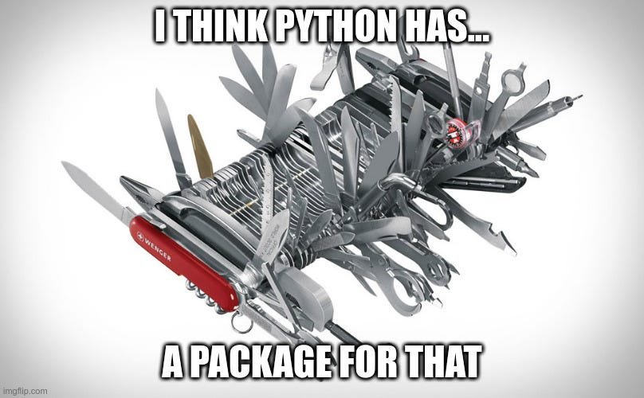
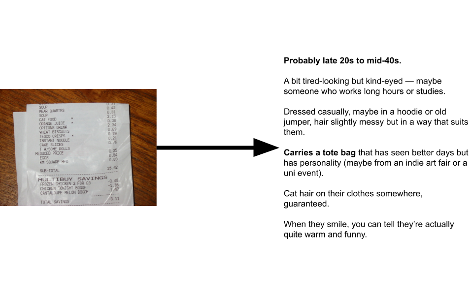
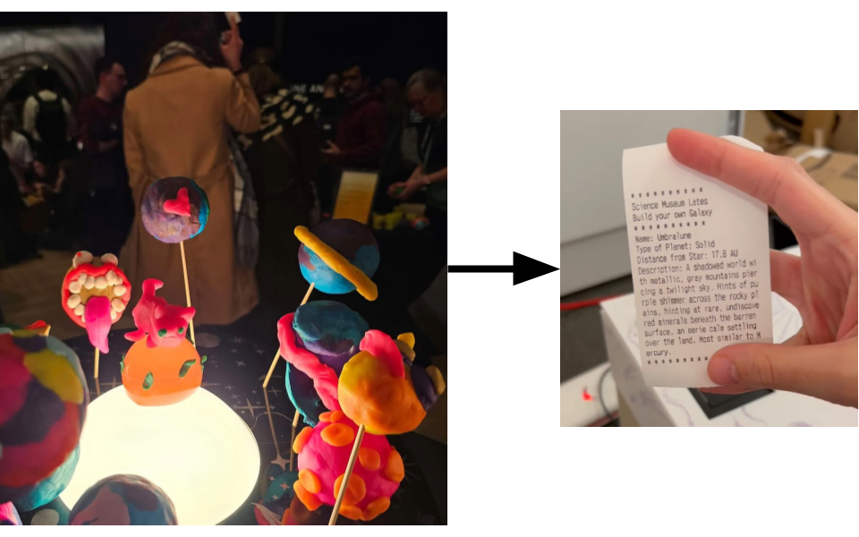
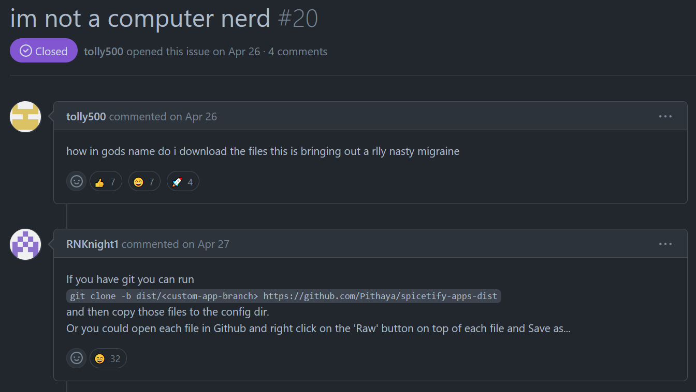

# Python for Creative Projects 🐍

---
# Python is Versatile

---

---

---

---

---

### Python has "a library for everything."

It can be like the glue that brings together a bunch of different tools.

---

---

